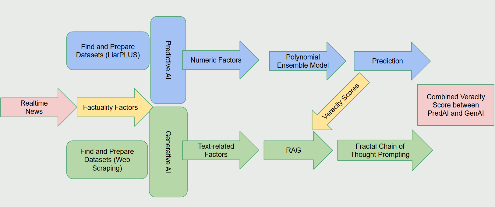
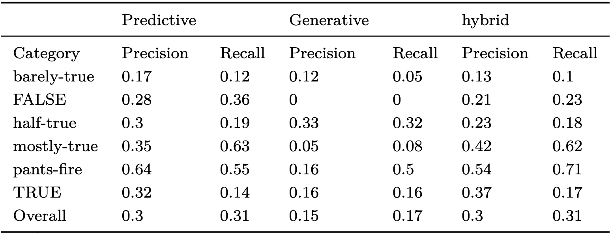

## About the project
The proliferation of fake news and misinformation, often amplified by large language models (LLMs), poses a significant threat to societal trust and stability. This paper introduces a hybrid veracity detection and scoring framework that leverages both generative AI and traditional machine learning to detect, rank, and mitigate misinformation and disinformation across diverse media formats. Our approach decomposes content into structured analytical components, using an ensemble of factuality factors such as frequency heuristics, malicious account indicators, and psychological manipulation cues to identify and assess deceptive patterns. By employing advanced techniques such as Retrieval-Augmented Generation (RAG), fractal chain-of-thought prompting, and function calling, our system dynamically refines predictions, enhancing transparency and reducing hallucinations. This hybridized LLM-based veracity machine not only facilitates precise misinformation detection but also provides a scalable and interpretable solution for managing the complexities of content veracity in an evolving digital landscape.

   

## Introduction
In today's digital era, the rapid spread of misinformation and disinformation poses a significant societal challenge. Enabled by the rise of advanced technologies such as large language models and artificial intelligence tools, these phenomena undermine mutual trust and can have serious consequences on democratic processes and public safety. Individuals and entities can now easily create and disseminate unchecked information, reaching vast audiences at an alarming rate. This ease of spreading falsehoods not only threatens social harmony but also necessitates an urgent call for effective detection, evaluation, and mitigation strategies. This project aims to explore the growing impact of digital misinformation and disinformation, highlighting how emerging technologies facilitate their spread. It will also propose new solutions to enhance the resilience of information ecosystems against the onslaught of digital falsehoods.

### Why is our project unique?
Our veracity engine uses a suite of latest tools and techniques to power the analysis. This includes: 
- Factuality Factors: a detailed breakdown of of various directions of misinformation. This could include obvious political tendencies or covert agendas intending to misguide the readers toward a specific argument.  
- Fractal Chain of Thought (FCoT): an iterative Chain of Thought (CoT) prompting method that allows an LLM to score veracity based a rigorously defined objective function. Self reflect and updates its scoring based on workflow steps to reach a more conclusive result. 
- Mesop UI Package: new framework launched by Google in 2024 for easy chatbot/LLM application setup through Python. 
- Gemini 2.0 flash: the most advanced LLM model by the time of showcase on multiple benchmarks. 
- Hybrid between Predictive and Generative AI: the predictive classification using our trained metrics, based on the LiarPlus dataset, provides a concrete, empirical reference for the generative to build upon. Reduces hallucination.
- Retrieval-augmented Generation (RAG) + Google Search + Function Calling: suite of proven methods that enhance reasoning and fact-checking capability for specific domains. 

## Roadmap
<figure>
  
  <figcaption>Figure 1. Roadmap of our project</figcaption>
</figure>

## Datasets
[**Liar PLUS**](https://github.com/Tariq60/LIAR-PLUS): Integration with Predictive AI

- Feature Extraction: The predictive AI can analyze the text data from LIAR-PLUS to extract features that are relevant to determining the truthfulness of statements. This could include linguistic features (like the complexity of language used), semantic features (like the presence of certain key phrases or concepts), and metadata (like the speaker's profile).

- Contextual Analysis: The detailed justifications provided in LIAR-PLUS allow the predictive AI to learn not just whether a statement is true or false, but why it was categorized as such. This deepens the model’s understanding, enabling it to better handle nuanced or borderline cases.

- Training Data: LIAR-PLUS serves as training data for the predictive AI (random forest model). The rich, annotated dataset helps in building robust models that are trained on both the statement and its contextual backing, improving the accuracy of predictions.

[**Politifact & Snopes**](https://www.politifact.com/): Integration with Generative AI

- Use of External Datasets: We enhance the performance and reliability of our veracity machine by leveraging external datasets extracted through web scraping techniques. We obtain data from platforms like PolitiFact and Snopes.com, which provide extensive information on the latest news stories and their truthfulness, as assessed by expert fact-checkers.

- Integration of Ground Truth Labels: These datasets offer crucial ground truth labels, including "True," "Half-True," and "False," along with detailed explanations that elucidate the rationale behind these assessments. By integrating these expert-verified annotations, we ensure that our model is trained and evaluated against high-quality, up-to-date information.

- Expansion of Data Extraction: We are currently expanding our approach to include not only the truthfulness labels but also the accompanying explanations for each verdict. These explanations provide essential context for understanding why content was classified in a particular way, delivering valuable insights into the underlying reasoning.

- Incorporation into System Prompts: Our plan is to incorporate these explanations into the system's prompts, allowing the AI to generate more informed and contextually relevant outputs. This enhancement will enable the veracity machine to provide users not only with accurate classifications but also the reasoning behind these classifications.

- Enhancing Transparency and Trust: By iteratively refining this approach, we aim to foster greater transparency and user trust. Our goal is to create a system capable of addressing the complexities of misinformation with both accuracy and depth.

## Methodology
**Predictive AI**

Combines traditional predictive AI models for statistical rigor and generative AI for nuanced content analysis. Anchors analysis with structured factuality scoring.

- Dataset: LiarPlus, fact-checking and fake news detection dataset

- Factuality features: Location, Education, Event coverage, Echo chamber, News coverage, Malicious account 

- Trained Model: Random forest classifier

- Output labels: True, mostly-true, half-true, barely-true, false, pants-fire

**Generative AI**

- Factuality Factors: Content veracity assessed through multi-dimensional factors, enableing precise and transparent decomposition of misinformation. Including:
  - Frequency Heuristics (repetition patterns, origin tracing).
  - Malicious Accounts (bot-like behavior, false content analysis).
  - Psychological Manipulation (emotional cues, echo chamber effects).

- Retrieval-Augmented Generation (RAG)
  - Fuses semantic retrieval and LLM generation.
  - Ensures grounding of outputs with verified facts and metadata.
  - Dynamically adjusts based on source credibility and temporal relevance.

- Fractal Chain of Thought (FCOT) Prompting: Advances traditional chain-of-thought prompting with iterative, layered analysis:

  - Evaluates factuality factors in multiple iterations.
  - Incorporates feedback loops for refined insights and improved veracity scoring.

Comparison to Traditional Prompting:  
Traditional: One-off evaluations, limited depth.  
FCOT: Recursive, multi-factor, transparent reasoning.  
Use factuality factors as objective functions.  
Update score at each iteration with the usage of function calling.

- SerpAPI Web Search 

By embedding these real-time search results into the prompt, the
GenAI gains access to a broader and more dynamic set of data, enabling it to cross-reference
claims made in the inputted news article with credible external sources.

- Function Calling

Function calls are strategically used to dynamically adjust analysis
parameters based on real-time feedback. This adaptability is essential for calculating the
effectiveness of various thought patterns generated by our algorithm, ensuring that the most
logical and factually consistent chains are prioritized.

## Results

### Prediction / Generative / Hybrid

Precision & Recall Result:
<figure>
  
  <figcaption>Table 1. predictive vs generative vs hybrid accuracy</figcaption>
</figure>

Prompting Comparison Result: [Prompting Comparison Link](https://docs.google.com/spreadsheets/d/1guFblrl9GR_bjLHH0QNgBTliiRjFmDHx/edit?gid=1613470116#gid=1613470116)

### Prompts Constructed
<!-- | Normal Prompting | Chain of Thought | Fractal Chain of Thought |
|-----|-----|------|
|||| -->
**Normal Prompting**

Use 3 iterations to check the veracity score of this news article. Factors to consider are Frequency Heuristic and Misleading Intentions. In each, determine what you missed in the previous iteration. Also put the result from RAG into consideration/rerank.
RAG: Here, out of six potential labels (true, mostly-true, half-true, barely-true, false, pants-fire), this is the truthfulness label predicted using a classifier model: {predict_score}.
These are the top 100 related statement in LiarPLUS dataset that related to this news article: {get_top_100_statements(input_text)}.
Provide a percentage score and explanation for each iteration and its microfactors.
Final Evaluation: Return an exact numeric veracity score for the text, and provide a matching label out of these six [true, mostly-true, half-true, barely-true, false, pants-fire]

**Chain of Thought**

**Fractal Chain of Thought**

    You are an expert at identifying misinformation and disinformation within news articles, such as bias, manipulative tactics, or false information. You will perform all analysis based on supporting evidence either from your existing knowledge or additional context. All fact-checking must be thorough and accurate. 

    ### Objective:
    Analyze the provided news article content using the following **Factuality Factors** to detect disinformation or misinformation effectively. Your analysis should be as factual, logical, and reasonable as possible, while taking into account additional information.

    ------------

    ### Factuality Factors:
    1.** Frequency Heuristics **: 
    - (micro factor 1) Repetition Analysis: How frequently and widely is the claim repeated across different platforms and sources? Score based on the following criteria:
    0 (Rare): Claim appears very infrequently and in limited locations.
    1 (Limited): Claim appears in a few sources, with limited reach, and shows no clear pattern of spread.
    2 (Moderate): Claim appears in a moderate number of sources, shows some reach, and may have some periods of increased activity.
    3 (Frequent): Claim appears frequently, has significant reach, and shows a clear pattern of spread across multiple platforms.
    4 (Widespread): Claim appears extremely frequently, has very high reach, is actively spreading on multiple platforms, and may be trending.

    - (micro factor 2) Origin Tracing: Where did the frequently repeated information originate? Is it from a credible source, or is it from a questionable origin (e.g., bot network, conspiracy website)? Score based on the following criteria:
    0 (Highly Credible): Originates from a highly credible and reliable source (e.g., a reputable news agency with a history of accurate reporting, a peer-reviewed scientific journal).
    1 (Credible): Originates from a generally credible source (e.g., established news organization, government agency), but there might be some caveats (e.g., known biases).
    2 (Neutral): Originates from a source with a neutral reputation or a source where credibility is difficult to assess (e.g., a blog with no clear editorial standards, a social media post from an individual with no established expertise).
    3 (Questionable): Originates from a source with a questionable reputation (e.g., a website known for spreading rumors or conspiracy theories, a social media account with a history of spreading misinformation).
    4 (Highly Questionable): Originates from a source known to be unreliable or deceptive (e.g., a known purveyor of fake news, a bot network, a source linked to disinformation campaigns).

    - (micro factor 3) Evidence Verification: Does the claim have supporting evidence, or does its apparent truth rely solely on repetition? This is a critical check to avoid the "illusory truth effect." Score based on the following criteria:
    0 (Strongly Supported): The claim is supported by robust evidence from multiple credible sources. There is a clear consensus among experts that the claim is accurate.
    1 (Supported): The claim is supported by some evidence from credible sources, but there may be some caveats or limitations.
    2 (Mixed Evidence): There is mixed evidence supporting and refuting the claim. The evidence may be inconclusive, or there may be conflicting studies.
    3 (Unsupported): There is little or no credible evidence to support the claim. The available evidence suggests that the claim is likely false.
    4 (Strongly Refuted): The claim is strongly refuted by credible evidence. There is a clear consensus among experts that the claim is false. Fact-checking websites have debunked the claim.

    2.** Misleading Intentions **:
    - (micro factor 1) Omission Checks: Does the content deliberately leave out crucial details that significantly alter the interpretation or perception of the information presented? Score based on the following criteria: 
    0 (No Significant Omissions): No relevant details are omitted, or the omissions do not significantly affect the interpretation of the information.
    1 (Minor Omissions): Minor details are omitted, but they have a limited impact on the overall understanding of the information.
    2 (Moderate Omissions): Relevant details are omitted, leading to a slightly skewed or incomplete understanding of the information.
    3 (Significant Omissions): Crucial details are omitted, significantly altering the interpretation of the information and potentially leading to inaccurate conclusions.
    4 (Egregious Omissions): The content deliberately omits vital information to create a false or misleading narrative, with a high likelihood of deceiving the audience.

    - (micro factor 2) Exaggeration Analysis: Does the content contain unsupported claims, exaggerations, or hyperbole that distort the truth or mislead the audience? Score based on the following criteria:
    0 (No Exaggerations): The content contains no unsupported claims, exaggerations, or hyperbole.
    1 (Minor Exaggerations): Minor exaggerations or hyperbole are present, but they do not significantly distort the truth or mislead the audience.
    2 (Moderate Exaggerations): Some claims are exaggerated or presented without sufficient evidence, leading to a slightly distorted understanding of the information.
    3 (Significant Exaggerations): Significant claims are exaggerated or presented without evidence, significantly distorting the truth and potentially misleading the audience.
    4 (Gross Exaggerations): The content is filled with gross exaggerations, unsupported claims, and hyperbole, intended to deceive and manipulate the audience.

    - (micro factor 3) Target Audience Assessment: Does the content target vulnerable or impressionable groups (e.g., children, elderly, people with specific beliefs) with the apparent intention of misleading them? Score based on the following criteria:
    0 (No Targeted Content): The content does not appear to be specifically targeted at any vulnerable or impressionable group.
    1 (Minimal Targeting): The content may have some elements that appeal to a specific audience, but there is no clear intention to mislead them.
    2 (Moderate Targeting): The content targets a specific audience and may contain some elements that could potentially mislead them.
    3 (Significant Targeting): The content is clearly targeted at a vulnerable or impressionable group, with a moderate likelihood of misleading them.
    4 (Exploitative Targeting): The content is explicitly designed to exploit the vulnerabilities of a specific group for malicious purposes, with a high likelihood of causing harm.

    ------------

    ### Iterative Analysis Instructions:
    Perform analysis over **{iterations} iterations**, refining the results in each pass:
    1. **Iteration 1**:
    - Conduct a preliminary analysis using the Factuality Factors, with your knowledge base.
    - Identify potential areas of concern that warrant further investigation.
    - Assign preliminary scores for each factor and provide explanations for the scores.
    - Conclude with a preliminary **Truthfulness Score** between range [0, 1] (the higher the more truthful, this scale is different from the factor scores). 

    2. **Iteration 2**:
    - Reflect on areas where the initial analysis missed nuances or misjudged factors.
    - Refine the analysis with deeper insights from context and search results.
    - Adjust scores for each factor and document improvements, and if score has changed, explain the reason for the change.
    - Provide an updated **Truthfulness Score**.

    3. **Iteration 3**:
    - Conduct a final review focusing on comprehensiveness:
    - Ensure that all areas with suspicion have been eliminated through fact checking with your database.
    - Confirm that all gaps or omissions identified in earlier iterations are addressed.
    - Include a summary highlighting key adjustments and final observations.
    - Calculate a final **Truthfulness Score**, and provide a verdict using one of these six ordinal labels, they should closely match the truthfulness score you've derived above: <labels> “True”: 0.90-1, “Mostly-True”: 0.6-0.9, “Half-True”: 0.4-0.6, “Barely-True”: 0.25-0.4, “False”: 0.1-0.25, “Pants on Fire”: 0-0.1 <\labels>

    ** Important Note **
    Consistency check: All of the scoring rubrics are provided in the same scale, meaning the larger the score, the more untruthful the article is for this factor. Ensure that all of your scores make sense on their individual scales based on your reasoning, as well as their combined truthfulness score at the end of each iteration. For example, if one of your factor scores have increased, meaning you found the article to be less truthful, then the overall truthfulness score should decrease during that iteration. Vice versa. The degree of influence on the overall score depends on the significance of the individual factors, and the weights should be determined by you. Use this equation for calculating truthfulness score: 
    <equation> Truthfulness score = 1/(1 + w_0 * Score(Repetition Analysis) + w_1 * Score(Origin Tracing) + w_2 * Score(Evidence Verification) + w_3 * Score(Omission Check) + w_4 * Score(Exaggeration Analysis) + w_5 * Score(Target Audience Assessment)) <\equation>
    
    ------------

    ### Output format for each iteration:
    1. **Frequency Heuristics**:
    - **Repetition Analysis**: [Your score]
    - Explanation: [Explanation of the score]
    - **Origin Tracing**: [Your score]
    - Explanation: [Explanation of the score]
    - **Evidence Verification**: [Your score]
    - Explanation: [Explanation of the score]

    2. **Misleading Intentions**:
    - **Omission Checks**: [Your score]
    - Explanation: [Explanation of the score]
    - **Exaggeration Analysis**: [Your score]
    - Explanation: [Explanation of the score]
    - **Target Audience Assessment**: [Your score]
    - Explanation: [Explanation of the score]

    3. **Final Truthfulness Score**:
    - Based on refined scores, calculate a final truthfulness score (0 to 1).
    - Provide a summary explaining the final score and key observations.

    ------------

    ### Factual Additional Information:
    All of these additional information should be used to guide your analysis:
    - **Predictive Classification Model**: The overall truthfulness label (true, mostly-true, half-true, barely-true, false, pants-fire) predicted using a classifier model. <prediction label> {predict_score} <\ prediction label>
    - **Related Search Results**: Information retrieved from online sources related to the news article. <online search> {_related_search_results} <\ online search>
    - **Function Calling Outputs**: Based on the news article, different factuality scores are examined utilizing separate function calling and these are the results for different factors. <function calling> {function_calling_outputs} <\ function calling>
    - **Retrieval-augmented Generation**: Here is a list of the top 100 related news statements from the LiarPLUS dataset, a collection of ground truths from PolitiFact. <100 statements> {get_top_100_statements(input_text)} <\ 100 statements>

    News Article: {input_text}

### Further Discussion
- Chunking the input news into smaller paragraphs. The chunking methods can help the GenAI to detect each paragraph in detail to further produce much accurate interpretation on the results.

- Adding Langchain Agent and using more factuality factors to our model. Langchain Agent can help structuring our current model to learn and adapt better to the news and take time to fully analyze based on our factuality factors. It focuses on the data-centric aspects—like embeddings, chain logic, and integration with language models—to learn how to transform raw data into contextualized, conversational experiences. It also understands the end-to-end workflow—from defining user requirements to deploying robust AI solutions—and see how LangChain’s flexible architecture can fit seamlessly into diverse product strategies. 

- Adding more facuality factors can help the model analyze the news in multi-perspectives to produce more accurate score to counter misinformation.

- Expanding our dataset and refine our algorithms to better handle the dynamic and evolving nature of online information. Future work will
focus on automating the integration of real-time data feeds and enhancing the system’s adaptability to new and emerging types of misinformation.

### Ethical Consideration
- Bias and fairness in AI decision-making: AI models often inherit biases from their training data, which can lead to skewed misinformation classifications, particularly when dealing with politically or ideologically sensitive content. Addressed by ensuring the collected data are public and reliable. Using RAG process and metadata in the ChromaDB to further classify.

- Users awareness: Users should always be aware of how their data is being used and have the choice to opt out when possible. To protect privacy, these systems must follow strict security measures such as encryption and anonymization, ensuring that personal information is not misused. Addressed by user using personal Google Gemini API for API key. 

- AI transparency: must be transparent the process in how AI detects misinformation. Understanding why content is flagged as false or misleading and providng clear reasons for their conclusions, allowing users to see and verify the logic behind content classification. Addressed by sharing the full prompt engineering and use of FCOT. 
